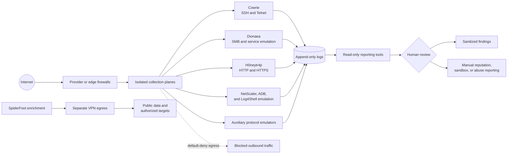

# Honeypot Field Notes

What actually reaches an exposed SSH, Telnet, SMB, HTTP, or HTTPS service—and
how can it be studied without turning the sensor into a launch point?

This repository publishes sanitized observations from isolated,
internet-facing honeypots. It combines real traffic measurements, selected
indicators, short case studies, containment lessons, and small read-only tools
for turning sensor logs into defensible summaries.

> **Defensive research only.** No raw malware, credentials, private sensor
> addresses, notification secrets, or live infrastructure details are stored
> here.

## Research snapshot

The figures below combine reviewed September 2026 datasets with two accepted
metadata-only censuses from October 2026. They are point-in-time snapshots, not
lifetime totals.

| Observation | Result |
|---|---:|
| HTTP and HTTPS request events | **27,935** |
| Web requests matching configured traps | **845** |
| Unique Dionaea capture hashes reviewed | **118** |
| Unique Cowrie transfer hashes reviewed | **17** |
| Unique hashes across both streams | **135** |
| CPU architectures in one Cowrie payload set | **5** |
| Public source IPs in one 48-hour VPS census | **1,901** |
| Public source IPs in one 72-hour T-Pot census | **2,671** |

The most important lesson was not simply that exposed services receive traffic.
It was how concentrated and repetitive that traffic can be: a handful of
sources generated most web requests, while SMB produced many same-sized files
with different cryptographic hashes.

[How the measurements were derived](docs/metrics.md)

## What stood out

- **A new family for this collection:** Dionaea captured an 82,435-byte Windows
  DLL classified publicly as Midie/ZombieBoy.
- **A previously unindexed hash:** another SMB-delivered DLL had no VirusTotal
  record at lookup time and became this project's first submission of that
  exact hash. Subsequent sandbox results associated it with known
  WannaCry/MS17-010 behavior—not a zero-day.
- **The collection expanded without weakening isolation:** a dedicated T-Pot
  host now complements the VPS sensors. Capture storage is separately mounted,
  selected honeypot egress is fail-closed through a VPN, and the management
  plane remains private.
- **More protocols, quieter alerts:** contained EPMAP/NetBIOS, SMTP, SOCKS5,
  and SNMP emulators broaden the observation surface. Routine connection
  activity is summarized, while completed-file alerts remain immediate.
- **Reconnaissance is separated from collection:** SpiderFoot runs on its own
  VPN-routed path so enrichment activity does not share honeypot egress. Its
  use remains limited to passive research and systems the operator is
  authorized to assess.
- **One deployment chain, five architectures:** Cowrie received ARM, AArch64,
  x86, x86-64, and RISC-V executables alongside shell scripts.
- **Web exploitation is highly automated:** probes targeted environment files,
  exposed Git metadata, PHPUnit paths, ThinkPHP invocation routes, PHP
  configuration abuse, and unauthenticated container APIs.
- **The collection surface now includes specialized emulators:** a NetScaler
  decoy, an Android Debug Bridge honeypot, and a Log4Shell-focused collector
  extend coverage beyond the original SSH, Telnet, SMB, and generic web views.
- **The first retained live-malware set from the dedicated T-Pot host was
  already known:** hash-only reputation results associated selected files with
  Medusa, Mirai, and Multiverze families. “First for this sensor” was kept
  separate from “new to the security community.”

[Read the case studies](docs/case-studies.md) ·
[Browse selected SHA-256 indicators](docs/observed-hashes.md)

## Collection and reporting flow



The public services and the management path are deliberately separate. Sensors
are treated as disposable and untrusted; dashboards, administration, secrets,
and raw evidence remain outside the public-facing network and outside this
repository.

[Architecture and containment details](docs/architecture.md)

## Included tools

Three dependency-free Python utilities reproduce the core reporting workflow:

| Tool | Reads | Produces |
|---|---|---|
| `cowrie_recent_transfers.py` | Cowrie JSON/JSON.GZ logs | Deduplicated uploads, downloads, hashes, and event counts |
| `dionaea_recent_captures.py` | Dionaea SQLite plus capture directory | Recent deliveries, hashes, sizes, protocols, and defanged URLs |
| `h0neytr4p_recent_requests.py` | H0neytr4p JSON log | Public-source counts, trap totals, payload events, and recent requests |

The tools do not execute files, upload samples, modify logs, or file abuse
reports. IP addresses and URLs are defanged in their output.

[Commands and usage](tools/README.md) ·
[Sanitized example output](docs/reporting-examples.md)

## Repository map

```text
.
├── ACKNOWLEDGMENTS.md
├── README.md
├── SECURITY.md
├── docs/
│   ├── architecture.md
│   ├── case-studies.md
│   ├── metrics.md
│   ├── observed-hashes.md
│   ├── reporting-examples.md
│   ├── research-highlights.md
│   └── safe-operations.md
└── tools/
    ├── README.md
    ├── cowrie_recent_transfers.py
    ├── dionaea_recent_captures.py
    └── h0neytr4p_recent_requests.py
```

## Boundaries

This repository intentionally excludes raw payloads, attacker credentials,
unsanitized sessions, sensor addresses, private topology, API keys, notification
topics, bulk-reporting files, and raw sandbox exports. External lookups and
submissions to AbuseIPDB, VirusTotal, ANY.RUN, or Hybrid Analysis remain manual
and operator-controlled.

See [Safe Operations](docs/safe-operations.md) and
[Security Policy](SECURITY.md) before adapting any material.

## Upstream projects

This work builds on T-Pot, Cowrie, Dionaea, and H0neytr4p. See
[ACKNOWLEDGMENTS.md](ACKNOWLEDGMENTS.md) for official project links and
attribution.

## Status and license

This is a public working repository. Its contents will evolve as additional
material is reviewed and sanitized. No open-source license has been selected;
publication alone does not grant permission to reuse the code or documentation.
