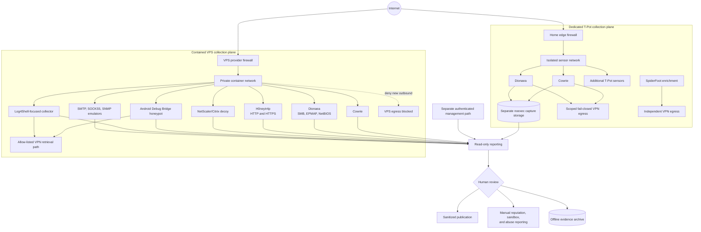

# Reference Architecture

The design separates collection, management, reporting, and analysis so a
compromised sensor cannot become a convenient path into the operator's normal
network.

## Design principles

1. Treat every sensor as disposable and untrusted.
2. Keep administration off public honeypot ports.
3. Deny new outbound connections from capture containers by default.
4. Persist logs and captures outside ephemeral container layers.
5. Send metadata in notifications, never payload attachments.
6. Summarize events using timestamps, protocol metadata, and source data.
7. Give reconnaissance tooling its own route and identity instead of sharing
   honeypot egress.
8. Put capture-capable services on bounded `noexec` filesystems and permit
   retrieval only through narrow, fail-closed routes.
9. Build dashboards from normalized metadata, never from raw payload content.

## Trust boundaries

The public listener is never the management interface. Administrative access,
dashboards, notification credentials, and evidence movement use a separate
path. A compromise of one sensor should therefore expose neither the normal
operator network nor another sensor's control plane.

Outbound denial is as important as inbound isolation. A honeypot that accepts a
payload but can freely contact arbitrary internet hosts can become useful to an
attacker. Egress controls are tested from the same container or network
namespace that handles hostile traffic.

The dedicated T-Pot host uses a narrower variation of that rule: only selected
capture networks receive fail-closed VPN egress, while management and unrelated
services do not inherit the route. SpiderFoot uses a different VPN-routed path
altogether. Network separation is a containment property, not permission to
scan third-party systems; active assessment remains limited to owned or
explicitly authorized targets.

Two specialized VPS collectors need limited HTTP/S retrieval because their
purpose includes observing attacker-supplied download locations. They use
dedicated container networks, private/reserved-destination denial, allow-listed
ports, and VPN-only egress. If that VPN path is absent, retrieval fails closed.
The host itself and the remaining honeypots do not inherit that route.

## Notifications and alert volume

Completed file captures produce immediate metadata-only alerts after the file
is stable and independently hashed. High-volume EPMAP, NetBIOS, SMTP, SOCKS5,
and SNMP connection events are grouped by protocol and source into periodic
summaries. This preserves visibility without turning routine internet noise
into one notification per packet or connection.

No notification contains raw malware, captured credentials, payload bodies, or
private topology.

## Private visualization

Normalized event metadata is copied into a private search and visualization
stack. One dashboard provides per-sensor filtering, capture hashes, event
counts, and recent activity. A separate animated attack map displays paced,
deduplicated source-to-sensor events while retaining raw event totals in the
underlying index. Neither interface is published on a public management port.

The display layer is deliberately not the evidence ledger. A plotted point or
dashboard row means that a normalized event was indexed; capture, archive,
reputation lookup, sandbox analysis, and public reporting remain separate
states.

## Data path

1. The sensor records an interaction in its native log format.
2. Capture storage and logs persist outside ephemeral container layers.
3. Metadata-only notification signals that a review may be needed.
4. A read-only tool produces a defanged summary.
5. A human excludes validation traffic and decides whether any external lookup,
   sandbox submission, abuse report, or public finding is justified.
6. Selected evidence moves directly to a removable archive and is verified by
   SHA-256; archive placement is tracked separately from external submission or
   analysis state.

This layout is intentionally generic. It does not disclose a live deployment's
addresses, credentials, notification channels, or provider configuration.
