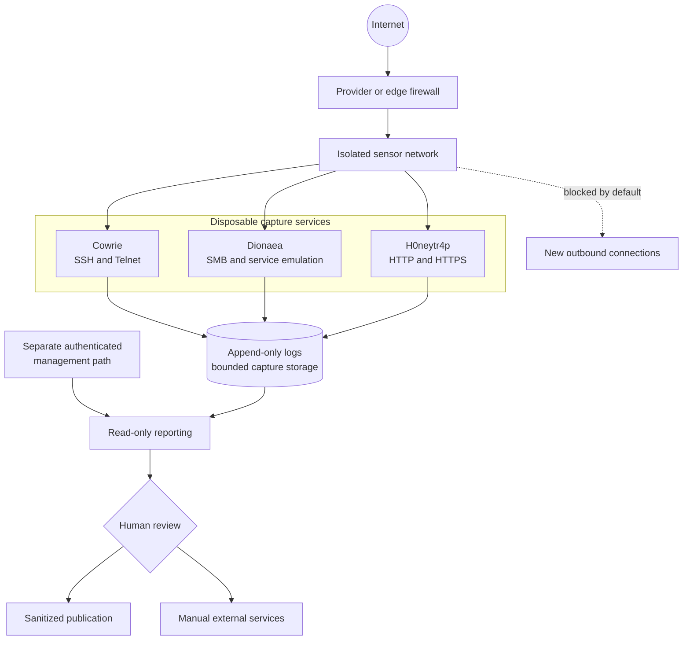

# Reference Architecture

The design separates collection, management, reporting, and analysis so a
compromised sensor cannot become a convenient path into the operator's normal
network.

## Design principles

1. Treat every sensor as disposable and untrusted.
2. Keep administration off public honeypot ports.
3. Deny new outbound connections from capture containers by default.
4. Persist logs and captures outside ephemeral container layers.
5. Send metadata in notifications, never payload attachments.
6. Summarize events using timestamps, protocol metadata, and source data.

## Trust boundaries

The public listener is never the management interface. Administrative access,
dashboards, notification credentials, and evidence movement use a separate
path. A compromise of one sensor should therefore expose neither the normal
operator network nor another sensor's control plane.

Outbound denial is as important as inbound isolation. A honeypot that accepts a
payload but can freely contact arbitrary internet hosts can become useful to an
attacker. Egress controls are tested from the same container or network
namespace that handles hostile traffic.

## Data path

1. The sensor records an interaction in its native log format.
2. Capture storage and logs persist outside ephemeral container layers.
3. Metadata-only notification signals that a review may be needed.
4. A read-only tool produces a defanged summary.
5. A human excludes validation traffic and decides whether any external lookup,
   sandbox submission, abuse report, or public finding is justified.

This layout is intentionally generic. It does not disclose a live deployment's
addresses, credentials, notification channels, or provider configuration.
