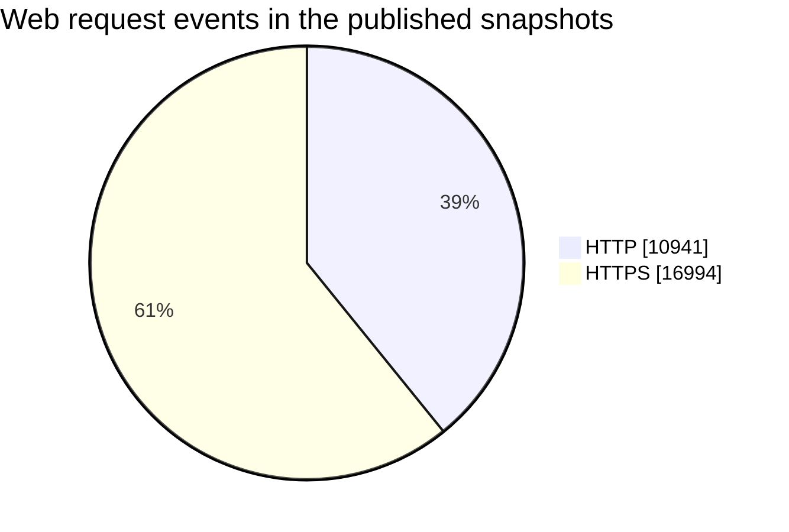

# Measurement Snapshot

These measurements summarize reviewed September 2026 datasets. They are
point-in-time research snapshots, not lifetime counters and not estimates of
the number of human attackers.

## Web sensors

| Sensor view | Request events | Unique public sources | Trap matches | Payload events |
|---|---:|---:|---:|---:|
| HTTP on TCP 80 | 10,941 | 128 | 145 | 1 |
| HTTPS on TCP 443 | 16,994 | Not published | 700 | 2 |
| **Combined events** | **27,935** | — | **845** | **3** |

All three payload events in these snapshots were controlled validation uploads,
not attacker-delivered files. They are excluded from the research findings.

Request volume was heavily concentrated. One automated source accounted for
most requests in each snapshot, so request count must not be presented as a
count of unique attackers.

## Capture hashes reviewed

| Collection stream | Review batches | Distinct SHA-256 values |
|---|---:|---:|
| Dionaea service captures | 4 | 118 |
| Cowrie SSH/Telnet transfers | 4 | 17 |
| **Total across both streams** | **8** | **135** |

The hash count represents distinct file content in the reviewed result tables.
It does not mean 135 distinct malware families. Dionaea in particular received
many same-sized WannaCry-family variants with different hashes.

## Latest Dionaea review

The newest 43-hash Dionaea batch contained 41 hashes that already had public
VirusTotal records. All 41 were Windows DLLs with 49–68 malicious detections in
the saved lookup snapshot; 40 received a Wanna/WannaCry-family suggestion. Two
hashes were not indexed at lookup time and were submitted manually. One later
received 60 malicious detections out of 71 engines and a WannaCry-family label;
the other submission's later score was not recorded in the public dataset.

These are hash-review results, not proof that every delivery represented a
different campaign or operator.

## Cowrie architecture diversity

One reviewed delivery set contained executables for five CPU targets:

| Architecture | Typical target class |
|---|---|
| ARM 32-bit | Routers and embedded Linux devices |
| AArch64 | Newer ARM devices and servers |
| x86 32-bit | Older Linux hosts and appliances |
| x86-64 | Commodity servers and desktops |
| RISC-V | Emerging embedded and Linux targets |

Shell scripts accompanied the executables and selected an architecture-specific
payload at runtime. This is characteristic of broad opportunistic deployment,
not evidence that the source knew the honeypot's real hardware.

## Counting rules

- A **request event** is one parsed HTTP/S log record from a public source.
- A **trap match** is a request marked by the sensor's configured trap logic.
- A **capture hash** is one unique full SHA-256 value in a reviewed result set.
- Repeat delivery of the same content does not increase the unique-hash count.
- Different hashes are not automatically different malware families.
- Operator tests, internal addresses, and loopback traffic are excluded from
  public conclusions.

The source data remains private because it contains live addresses, internal
paths, and unsanitized attacker activity. Only reviewed aggregates are
published here.
